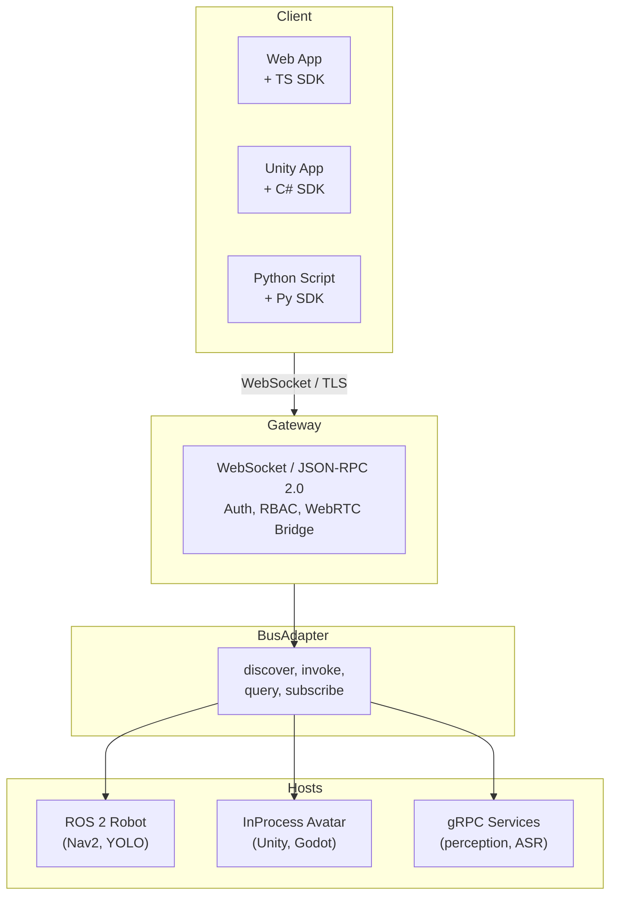

# OpenRoIS - An Open-Source Middleware for the OMG RoIS Framework 2.0

**Paradigm-neutral middleware for controlling robots, avatars, and digital agents over the internet.**

OpenRoIS is an open-source middleware implementing the
[OMG RoIS Framework 2.0](https://www.omg.org/spec/RoIS/2.0/Beta2) specification. It lets
operator applications control **physical robots, virtual avatars, and digital
agents** through a single, paradigm-neutral SDK. The host paradigm is hidden behind
a gateway. A scenario written once can drive a ROS 2 robot, a Unity avatar, or a
distributed AI service without code changes.

## What we are building

| Artifact | Description |
|----------|-------------|
| **RoIS Interfaces** | Transport-independent types derived from the OMG IDL. Authored as Python (Pydantic), exported to JSON Schema, generated into C# and TypeScript. |
| **RoIS Engine + Gateway** | Bus-independent runtime (Python) that manages components and exposes them remotely over WebSocket. |
| **RoIS BusAdapters** | Pluggable bindings: ROS 2 (robot), InProcess (avatar), gRPC (services). All implement one four-method contract. |
| **RoIS Components** | The 17 basic HRI components with per-paradigm backends (YOLO, MediaPipe, Whisper, Nav2, Piper). |
| **RoIS Client SDKs** | C# for Unity (primary), TypeScript for web, Python for scripting. Identical behavior regardless of host paradigm. |

## Architecture at a glance

The same four layers compose into physical robots, mixed fleets, single-process
avatars, and distributed services. Only the BusAdapter and host layout change.

## Key ideas

- **Symbolic level interaction.** Applications exchange structured messages ("person
  detected, count: 2"), not raw sensor data. Hardware-specific concerns are hidden
  behind standardized interfaces.
- **Paradigm-neutral core.** The engine, gateway, and SDK depend only on a
  four-method `BusAdapter` contract. Adding a new paradigm is an additive adapter,
  never a rewrite.
- **Single source of truth for types.** Python Pydantic models are the source. JSON
  Schema is the canonical wire format. C# and TypeScript types are generated, never
  hand-written.
- **Transport-appropriate.** WebSocket for remote control, ROS 2/DDS for the robot
  bus, in-process calls for avatars, gRPC for distributed services, WebRTC for media.
  The right transport at each boundary, not one transport everywhere.
- **The SDK is the product.** Adoption is driven by how easy it is to write a
  scenario. The SDK is identical whether the host is a robot or an avatar.

## Status

**Alpha, pre-1.0, unstable API.** The interface types (M0) are complete and stable.
The engine, gateway, bus adapters, components, and SDKs are under construction.

| Milestone | Theme | Status |
|-----------|-------|--------|
| M0 | Paradigm-Neutral Interfaces | DONE |
| M1 | Engine and In-Process Bus | TODO |
| M2 | Remote Gateway | TODO |
| M3 | ROS 2 Bus Adapter | TODO |
| M4 | Mock ROS 2 Robot Components | TODO |
| M5 | SDK and Robot MVP (v0.1.0) | TODO |
| M8 | Real Component and Mixed Paradigm | TODO |
| M9 | Auth and Bus Security | TODO |
| M10 | WebRTC Media | TODO |
| M11 | Full Component Library (v1.0) | TODO |

<!-- ## Repositories

| Repo | Description |
|------|-------------|
| [openrois](https://github.com/openrois/openrois) | Core middleware: interfaces, engine, gateway, bus adapters, components, SDKs |
| [openrois-internal](https://github.com/openrois/openrois-internal) | Internal documentation: plans, architecture, branding, internship materials | -->

## Documentation

- [White paper](https://github.com/openrois/openrois/blob/main/docs/white-paper.md) - architecture, design decisions, wire protocol, and deployment topologies
- [Architecture](https://github.com/openrois/openrois/blob/main/docs/architecture.md) - engineering design document
- [Roadmap](https://github.com/openrois/openrois/blob/main/docs/roadmap.md) - milestone roadmap
- [RoIS reference](https://github.com/openrois/openrois/blob/main/docs/rois-reference.md) - OMG specification summary

## Community

- **License:** Apache-2.0
- **Spec:** [OMG RoIS Framework 2.0](https://www.omg.org/spec/RoIS/2.0/Beta2)
<!-- - **Contributions:** Welcome. Reference components are the natural entry point for
  new contributors. See the roadmap for parallelizable work items. -->

---

*OpenRoIS is an open-source middleware for the OMG RoIS Framework 2.0. Control
robots, avatars, and digital agents from one paradigm-neutral SDK. Apache-2.0.
Alpha, pre-1.0, unstable API.*
