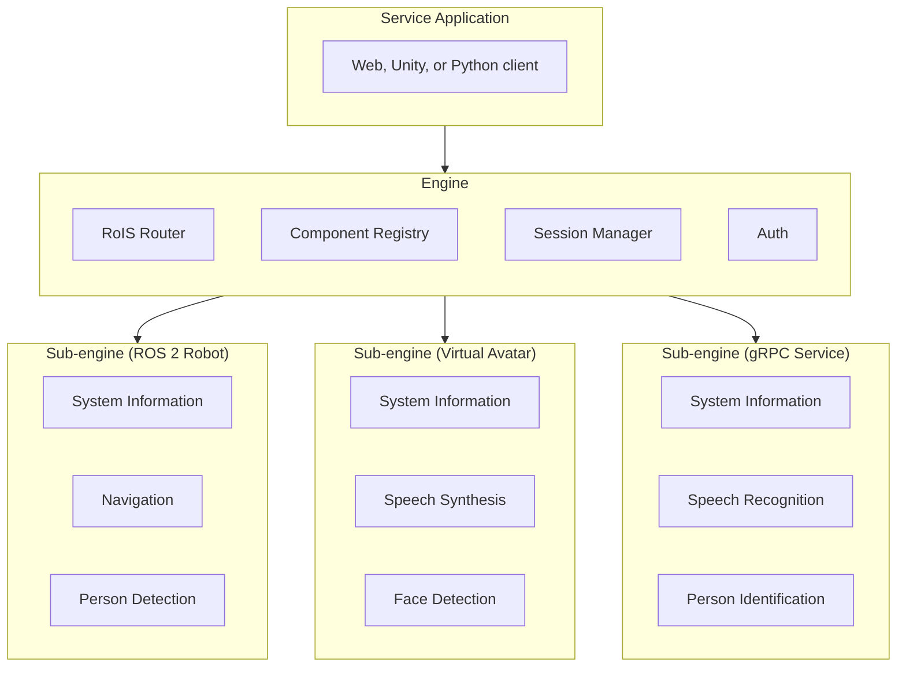

# OpenRoIS - An Open-Source Middleware for the OMG RoIS Framework 2.0

**Paradigm-neutral middleware for controlling robots, avatars, and digital agents over the internet.**

OpenRoIS is an open-source middleware implementing the
[OMG RoIS Framework 2.0](https://www.omg.org/spec/RoIS/2.0/Beta2) specification. It lets
service applications control **physical robots, virtual avatars, and digital
agents** through a single, paradigm-neutral SDK. The host paradigm is hidden behind
the engine. A scenario written once can drive a ROS 2 robot, a Unity avatar, or a
distributed AI service without code changes.

## What we are building

| Artifact | Description |
|----------|-------------|
| **RoIS Interfaces** | Transport-independent types derived from the OMG IDL. Authored as Python (Pydantic), exported to JSON Schema, generated into C# and TypeScript. |
| **RoIS Engine** | Control-plane router (TypeScript, Node.js) that routes RoIS calls to sub-engines over WebSocket + JSON-RPC. Zero media imports, zero WebRTC, embeddable module. |
| **RoIS Sub-engines** | Standalone processes that host components and connect to the engine via WebSocket. Each owns its paradigm-specific transport (DDS, gRPC, animation API). |
| **RoIS Components** | The 17 basic HRI components with per-paradigm backends (YOLO, MediaPipe, Whisper, Nav2, Piper). |
| **RoIS Client SDKs** | TypeScript for web (primary), C# for Unity, Python for scripting. Identical behavior regardless of host paradigm. |

## Architecture at a glance

```mermaid
flowchart TB
    subgraph L1["Service Application"]
        App["Web, Unity, or Python client"]
    end

    subgraph L2["Engine"]
        direction TB
        Router["RoIS Router"]
        Registry["Component Registry"]
        Session["Session Manager"]
        Auth["Auth"]
    end

    subgraph Robot["Sub-engine (ROS 2 Robot)"]
        direction LR
        SysInfo["System Information"]
        Nav["Navigation"]
        Detect["Person Detection"]
    end
    subgraph Avatar["Sub-engine (Virtual Avatar)"]
        direction LR
        AvatarSys["System Information"]
        Speech["Speech Synthesis"]
        Face["Face Detection"]
    end
    subgraph AIService["Sub-engine (gRPC Service)"]
        direction LR
        AISys["System Information"]
        ASR["Speech Recognition"]
        Ident["Person Identification"]
    end

    L1 --> L2
    L2 --> Robot
    L2 --> Avatar
    L2 --> AIService
```

All three layers communicate over WebSocket + JSON-RPC 2.0. Each sub-engine
registers its components in a profile (`openrois-profile.yaml`) and owns its
internal transport (DDS, gRPC, IPC), keeping the engine free of paradigm-specific
protocols.

## Key ideas

- **Symbolic level interaction.** Applications exchange structured messages ("person
  detected, count: 2"), not raw sensor data. Hardware-specific concerns are hidden
  behind standardized interfaces.
- **Paradigm-neutral core.** The engine and SDK depend only on a five-method
  `SubEngine` interface (discover, invoke, query, subscribe, unsubscribe). Adding a
  new paradigm is an additive sub-engine, never a rewrite.
- **Single source of truth for types.** Python Pydantic models are the source. JSON
  Schema is the canonical wire format. C# and TypeScript types are generated, never
  hand-written.
- **Engine has zero media imports.** The engine is a pure control-plane router. It
  never touches WebRTC, never touches media data. Media flows directly between
  publisher and consumer.
- **The SDK is the product.** Adoption is driven by how easy it is to write a
  scenario. The SDK is identical whether the host is a robot or an avatar.

## Status

**Alpha, pre-1.0, unstable API.** The interface types (M0) are complete and stable.
The engine, sub-engines, components, and SDKs are under construction.

| Milestone | Theme | Status |
|-----------|-------|--------|
| M0 | Paradigm-Neutral Interfaces | DONE |
| M1 | Engine and Sub-engine | DONE |
| M2 | Remote Engine | DONE |
| M3 | ROS 2 Sub-engine | DONE |
| M4 | Mock ROS 2 Robot Components | TODO |
| M5 | SDK and Robot MVP (v0.1.0) | DONE |
| M8 | Real Component and Mixed Paradigm | TODO |
| M9 | Auth and Security | TODO |
| M10 | WebRTC Media | TODO |
| M11 | Full Component Library (v1.0) | TODO |

<!-- ## Repositories

| Repo | Description |
|------|-------------|
| [openrois](https://github.com/openrois/openrois) | Core middleware: interfaces, engine, sub-engines, components, SDKs |
| [openrois-internal](https://github.com/openrois/openrois-internal) | Internal documentation: plans, architecture, branding, internship materials | -->

## Documentation

- [White paper](https://github.com/openrois/openrois/blob/main/docs/white-paper.md) - architecture, design decisions, wire protocol, and deployment topologies
- [Architecture](https://github.com/openrois/openrois/blob/main/docs/architecture.md) - engineering design document
- [Roadmap](https://github.com/openrois/openrois/blob/main/docs/roadmap.md) - milestone roadmap
- [RoIS reference](https://github.com/openrois/openrois/blob/main/docs/rois-reference.md) - OMG specification summary

## Community

- **License:** Apache-2.0
- **Spec:** [OMG RoIS Framework 2.0](https://www.omg.org/spec/RoIS/2.0/Beta2)
<!-- - **Contributions:** Welcome. Reference components are the natural entry point for
  new contributors. See the roadmap for parallelizable work items. -->

---

*OpenRoIS is an open-source middleware for the OMG RoIS Framework 2.0. Control
robots, avatars, and digital agents from one paradigm-neutral SDK. Apache-2.0.
Alpha, pre-1.0, unstable API.*
