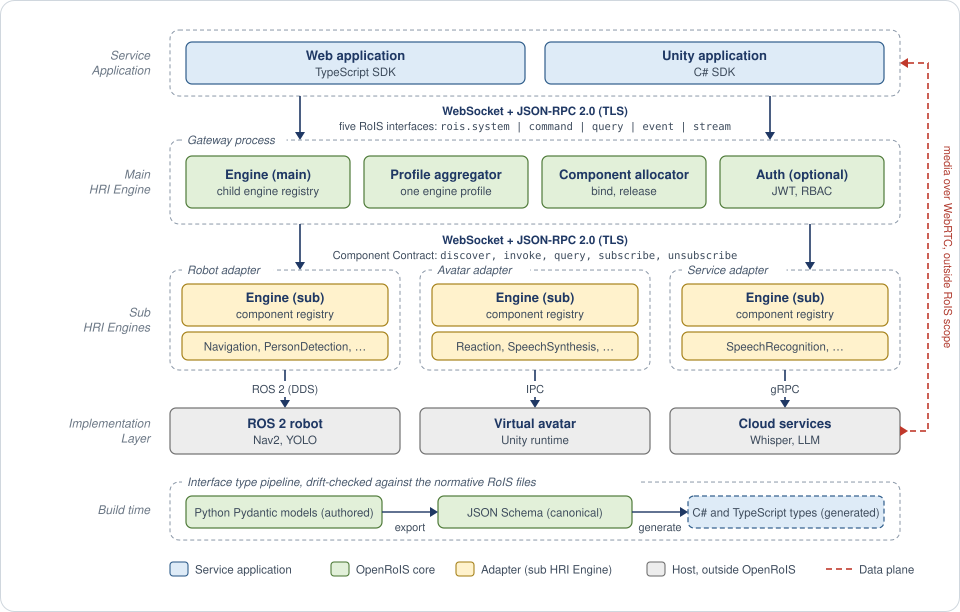

  

<h1 align="center">OpenRoIS</h1>

  <strong>A community-driven open-source middleware implementing the OMG Robotic Interaction Service (RoIS) Framework 2.0</strong> 
  Write a service application once. Run it on physical robots, virtual avatars, and AI services.

  
  
  
  
  

  <a href="https://openrois.org/">Website</a> ·
  <a href="https://github.com/openrois">OpenRoIS GitHub Organization</a> ·
  <a href="https://arxiv.org/abs/2609.21178">OpenRoIS arXiv Preprint</a> ·
  <a href="https://www.omg.org/spec/RoIS/2.0">OMG RoIS Specification</a> ·
  <a href="https://github.com/openrois/openrois/tree/dev/docs">Documentation</a> ·
  <a href="https://github.com/openrois/openrois/blob/dev/docs/roadmap.md">Roadmap</a>

---

## Why OpenRoIS

Service applications for human-robot interaction are usually written against the
hardware-specific interface of one platform, so every change of hardware forces a
rewrite. The [OMG RoIS Framework 2.0](https://www.omg.org/spec/RoIS/2.0) solves this
at the level of the standard: applications talk to HRI Engines through five
platform-independent interfaces and exchange symbolic messages such as
"a person was detected" or "navigate to the kitchen".

A specification alone does not provide the maintained implementation, SDKs, and
adapters that adoption requires. **OpenRoIS is that implementation**: community-driven,
open-source, and released under the Apache-2.0 license.

  <picture>
    <source media="(prefers-color-scheme: dark)" srcset="assets/openrois-concept-dark.svg">
    
  </picture>

## What OpenRoIS Provides

- **A recursive engine.** One `Engine` class realizes both the main and the sub HRI
  Engine roles of RoIS, so the gateway and every adapter share a single dispatch
  implementation.
- **A five-method Component Contract** (`discover`, `invoke`, `query`, `subscribe`,
  `unsubscribe`) that keeps the engine independent of ROS 2, gRPC, game engines, or
  any other middleware.
- **A JSON-RPC 2.0 mapping of the five RoIS interfaces** over WebSocket
  (`rois.system`, `rois.command`, `rois.query`, `rois.event`, `rois.stream`),
  usable from browsers and across the internet.
- **A single-source-of-truth type pipeline.** RoIS types are authored once as Python
  Pydantic models, exported to JSON Schema, and generated into TypeScript and C#,
  with tests that check them against the normative RoIS machine-readable files
  (not redistributed, so those tests run only where the OMG files are present).
- **SDKs for every side of the system:** TypeScript for web applications, C# for
  Unity and .NET, and a Python adapter SDK with ROS 2 support.

  <picture>
    <source media="(prefers-color-scheme: dark)" srcset="assets/openrois-architecture-dark.svg">
    
  </picture>

## Repositories

| Repository | Description |
|------------|-------------|
| [**openrois**](https://github.com/openrois/openrois) | Core middleware: interface types, recursive engine, adapter SDK, reference components, client SDKs, and examples |
| [**openrois-docs**](https://github.com/openrois/openrois-docs) | Source of the [openrois.org](https://openrois.org/) website and documentation |

## Project Status

OpenRoIS is **alpha, pre-1.0, with an unstable API**. The foundations are in place
and demonstrated with a physical robot. The rest of the RoIS surface is being built
in the open.

| Area | Status |
|------|--------|
| RoIS interface types (Python, JSON Schema, TypeScript, C#) | Available |
| Recursive engine, WebSocket server and client, and adapter SDK (Python) | Available, hardening |
| TypeScript client SDK and web component inspector | Available |
| Reference components for the Preferred Robotics Kachaka (gRPC and ROS 2) | Available |
| C# client SDK for Unity | Available |
| Open reference platform based on the Pollen Robotics Reachy Mini | In progress, simulated first |
| Authentication (JWT), authorization (RBAC), and TLS at the gateway | Available, off by default |
| Streaming Interface control plane (`rois.stream.*`) | Available |
| WebRTC media on the data plane (signaling through streaming components) | Planned |
| Packages on PyPI, npm, NuGet, and the Unity Package Manager | Planned |
| All 17 basic RoIS HRI Components (v1.0) | Planned |

See the [roadmap](https://github.com/openrois/openrois/blob/dev/docs/roadmap.md) for
the full plan.

## Get Involved

Contributions are welcome, and reference components for new robots are the natural
entry point. Read the
[contributing guide](https://github.com/openrois/openrois/blob/dev/CONTRIBUTING.md),
browse the [open issues](https://github.com/openrois/openrois/issues), or open a new
one to discuss an idea.

## License

OpenRoIS is released under the [Apache License 2.0](https://www.apache.org/licenses/LICENSE-2.0).
It is stewarded by [Coarobo GK](https://coarobo.com/) and developed with the
OpenRoIS community. OpenRoIS is a trademark of Coarobo GK. RoIS is a trademark of the
Object Management Group.
